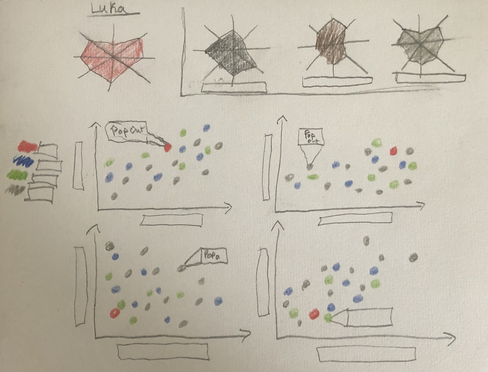

# Project-Outline

## Narrative: Luka Doncic is the most Exciting Player in the NBA
Luka Doncic has been an international basketball star since he became the youngest player to join the Real Madrid Basketball club at the age of 16. 2 years later, at the age of 18, he won the 2018 Euro League MVP and the scoring title. However, the question has consistently been asked - CAN HE PRODUCE IN THE NBA??? This presentation will assess Lukas first 2 years in the NBA and project his future success (OR FAILURE!)...

#### 1. Just a boy from Europe (General Background...)
- Basketball Culture in Europe
- Feelings towards international draft picks

#### 2. Draft Class and First Year in the NBA
- Quick Statistics Introduction and Metrics Breakdown
- Comparison to draft picks
- First season Stats w/ classmates comparisons, and other "greats" first years
- Making teammates better?

#### 3. Second year in the NBA
- Comparison to draft class
- comparison to "historic Greats" second years
- Comparison to other league leaders (Salary to reflect current valuation, key statistics)

#### 4. Playoff Production!!
- first playoffs... (how long did it take "greats" to get to the playoffs)
- historic comparisons, current leader comparisons...

#### 5 - Conclusion - Believe in Luka
- Show the progression of statistics highlighted in 3 and 4
- comprehensive final visualizations highlighting the most compelling data

### Needs:
- Statistics selection
- Player comparison selection
- Data wrangling

## Sketches:

## Data Source
The primary data for this presentation will come from Basketball-Reference (https://www.basketball-reference.com/). This site provides a comprehensive, publicly available repository of ALL basketball statistics (formal, mainstream, and invented) since 1974. The interface of the site provides maleable access to data files, allowing users to download specified CSV's which can be selected to focus on a range of metrics, players, teams, or time frames. Basketball-Reference is currently the de facto infrastructure supporting nearly all forms of basketball related analytics. For-profit advanced NBA analytics sites (such as cleaningtheglass) use Basketball-Reference as a source, as do media companies whose content is geared towards the general public (The Ringer).

The richness, and maleability of the Basketball-Reference data means that I will be able to customize, and import data table reports based on what I want to analyze. Ultimately, I will use Basketball-Reference as a source for current and historical data to generate metrics of Luka's success in the NBA, compared to current and historical players.

## Medium
Even though I have never used shorthand before, I am looking forward to using it for my final project presentation. I will give my presentation in person, (sharing screen in Zoom) and if appropriate, may rely on video transitions. I will try my hand at Tableua to create the visuals, although I will also rely on Flourish, and potentially excel. I may also include a supplemental slide deck (or potentially a separate github repository) for extra visualizations or data that did not make the final presentation. 

### Back To Main Page
https://nickwechter.github.io/Wecht-DataViz/
