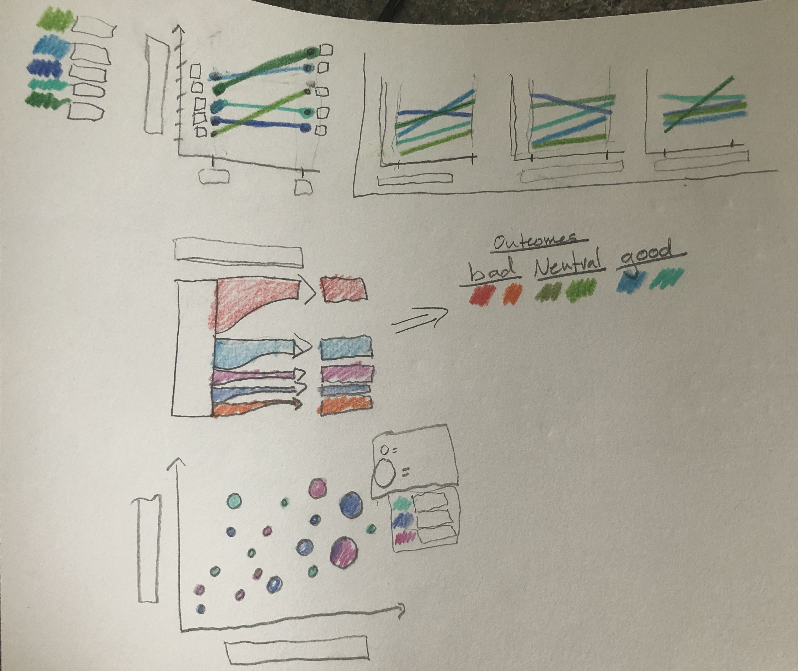

# Project-Outline

## Narrative: Luka Doncic is the most Exciting Player in the NBA
Luka Doncic has been an international basketball star since he became the youngest player to join the Real Madrid Basketball club at the age of 16. 2 years later, at the age of 18, he won the 2018 Euro League MVP and the scoring title. However, the question has consistently been asked - CAN HE PRODUCE IN THE NBA??? This presentation will assess Lukas first 2 years in the NBA and project his future success (OR FAILURE!)...

#### 1. Just a boy from Europe (General Background...)
- Basketball Culture in Europe
- Feelings towards international draft picks

#### 2. Draft Class and First Year in the NBA
- Quick Statistics Introduction and Metrics Breakdown
- Comparison to draft picks
- First season Stats w/ classmates comparisons, and other "greats" first years
- Making teammates better?

#### 3. Second year in the NBA
- Comparison to draft class
- comparison to "historic Greats" second years
- Comparison to other league leaders (Salary to reflect current valuation, key statistics)

#### 4. Playoff Production!!
- first playoffs... (how long did it take "greats" to get to the playoffs)
- historic comparisons, current leader comparisons...

#### 5 - Conclusion - Believe in Luka
- Show the progression of statistics highlighted in 3 and 4
- comprehensive final visualizations highlighting the most compelling data

### Needs:
- Statistics selection
- Player comparison selection
- Data wrangling

## Sketches:

**Radar Charts:** This will display the "most important" stats of multiple groups of benchmark players to see how Luka holds up in comparison. I will use radar charts as an introductory tool to capture Lukas overall stats for his 1st and 2nd year in the NBA. A potential title would be "Lukas Rookie Year, surprisingly well rounded"

**Grid of Dot Plots:** I would like to use these plots to show how Luka stands out against the masses in hyper-relevant metrics. Historic and current significant/recognizable players will have distinct color groups, while less significant players will have a low opacity and be used to establish the general trend. I would like users to be able to use their mouse to display information on any dot. An example title for one of these grids could be "Luka, great vision" and would display his position compared to other players with Assist Rate on the Y, and Turnover Rate on the X-axis. Each dot plot in the grid will highlight a dimension of Lukas game. 

**Line Charts:** The grid of line charts will be the primary workhorse in terms of showing Lukas progression between his first and second year in the NBA. Hyper-relevant stats will be selected, and each statistics relative rank in the NBA will be used to quantify the Y-axis. Multiple line charts will be used to display the progression of other notable players to provide context for Lukas data. An example title of the line charts could be: "Luka Doncic, unprecedented progression?"

**Flow Chart:** This will be a tough chart to use (because it will take a lot of data wrangling), but I would like to include it in my presentation. Ideally, the visualization will display the % of various results from when Luka touches the ball (Ex: Pass away [neutral], Turnover [negative], Assist 2pt [Positive], Score 3pt [Positive]...). An example title for this chart could be "What to expect when XXX is in control"

**Dot Plots (Vary Size):** This visualization will be very similar to the grid of dot plots, but the size of the dots will vary to communicate a 3rd variable (which will typically be the "volume" - players that do XYZ more will have larger dots than players that do XYZ less). 

## Data Source
The primary data for this presentation will come from Basketball-Reference (https://www.basketball-reference.com/). This site provides a comprehensive, publicly available repository of ALL basketball statistics (formal, mainstream, and invented) since 1974. The interface of the site provides maleable access to data files, allowing users to download specified CSV's which can be selected to focus on a range of metrics, players, teams, or time frames. Basketball-Reference is currently the de facto infrastructure supporting nearly all forms of basketball related analytics. For-profit advanced NBA analytics sites (such as cleaningtheglass) use Basketball-Reference as a source, as do media companies whose content is geared towards the general public (The Ringer).

The richness, and maleability of the Basketball-Reference data means that I will be able to customize, and import data table reports based on what I want to analyze. Ultimately, I will use Basketball-Reference as a source for current and historical data to generate metrics of Luka's success in the NBA, compared to current and historical players.

## Medium
Even though I have never used shorthand before, I am looking forward to using it for my final project presentation. I will give my presentation in person, (sharing screen in Zoom) and if appropriate, may rely on video transitions. I will try my hand at Tableua to create the visuals, although I will also rely on Flourish, and potentially excel. I may also include a supplemental slide deck (or potentially a separate github repository) for extra visualizations or data that did not make the final presentation. 

### Back To Main Page
https://nickwechter.github.io/Wecht-DataViz/
